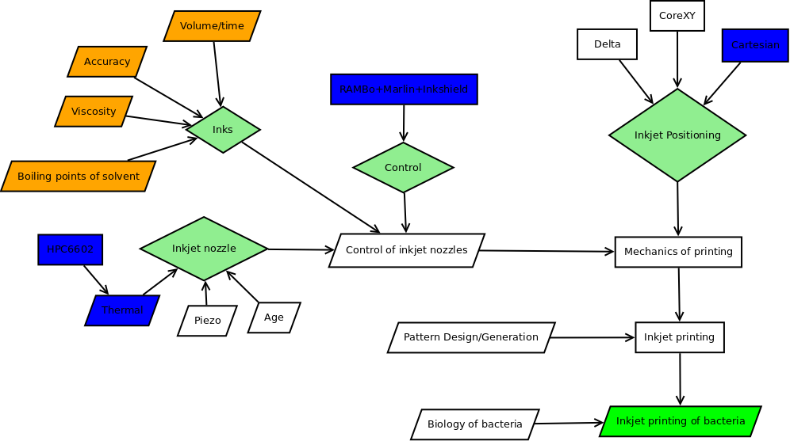

#Retrosynthetic Analysis
Jordan Miller introduced me to this technique. The wikipedia [page](http://en.wikipedia.org/wiki/Retrosynthetic_analysis) describes it as "a technique for solving problems in the planning of organic syntheses. This is achieved by transforming a target molecule into simpler precursor structures without assumptions regarding starting materials."

##Diagram
In this diagram orange boxes represent our basis for experimentation. Blue boxes represent our decisions. Light green diamonds represent decisions, and the neon green box is the objective.

